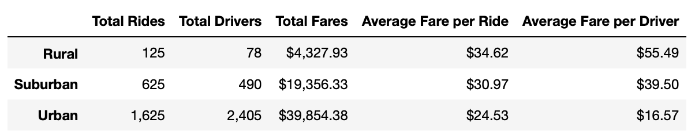

# PyBer_Analysis

Using Python, Jupyter Notebook, Pandas and Matplotlib to visually represent ride-sharing data to show the city types, number of drivers and total fares.

## Project Overview

The CEO wants you to create an overall snapshot of the ride-sharing data. She would like to see a summary table of key metrics of the ride-sharing data by city type, and a multiple-line graph that shows the average fare for each week by each city type.

## Resources

Data Source : city_data.csv , ride_data.csv

Software : Python 3.7.7, Anaconda 2019.07, Conda 4.11.7, Jupyter Notebook, Pandas, Matplotlib. 

## Summary

### Summary DataFrame Observations:  
   - Urban cities have the hightest total rides and drivers; while Rural cities have the lowest.  
   - Urban cities have the lowest average fare per ride and average fare per driver; while Rural cities have the highest. 
    

### Total Fare by City types Observations:  
   - The total fares for Rural cities fall in between $0 - $500.  
   - The total fares for Suburban cities fall in between $500 - $1500.  
   - The total fares for Urban cities fall in between $1500 - $2500.  

### Conclusions:  
   - The Urban cities seem to be have a higher demand and supply for rides.  
   - As the total rides and total drivers increases, the average fare per ride and average fare per driver decreases.
